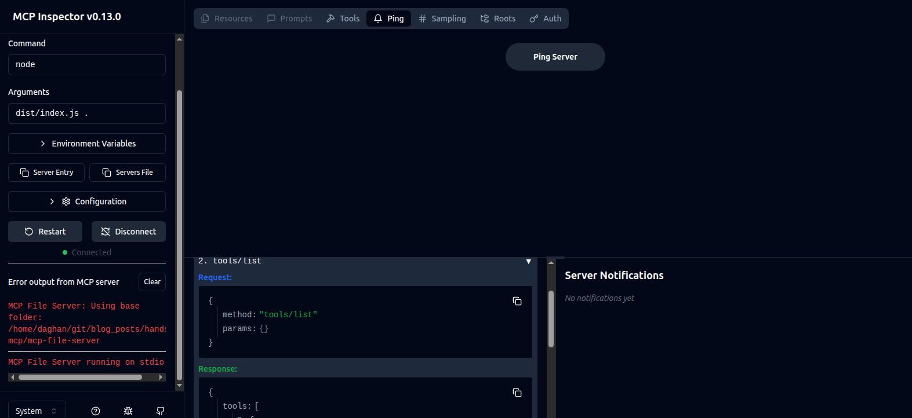
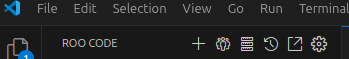
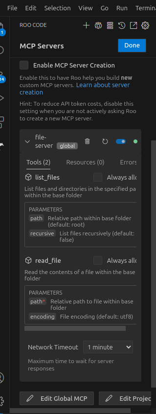
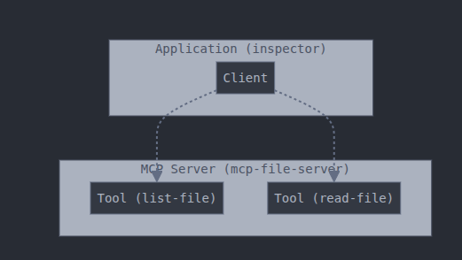
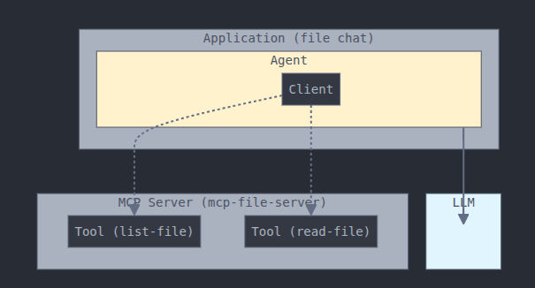

# Introduction

We are going to build an MCP server and integrate it into multiple agentic applications. MCP can be compared to REST API as discussed here https://docs.roocode.com/features/mcp/mcp-vs-api. In summary, REST APIs and MCP serve different tiers in the technology stack:

REST: Low-level web communication pattern that exposes operations on resources
MCP: High-level AI protocol that orchestrates tool usage and maintains context

MCP often uses REST APIs internally, but abstracts them away for the AI. Think of MCP as middleware that turns discrete web services into a cohesive environment the AI can operate within.

# Set up uv - Python package manager

For Linux run:

```bash
curl -LsSf https://astral.sh/uv/install.sh | sh
```

Detailed instructions can be found here https://docs.astral.sh/uv/getting-started/installation/

# Set up Roo

## Set up Roo plugin

Roo is our development environment that helps us build code. Roo is a generic tool that connects to LLM backend, in particular Claude, to help speed up development.

Open VS Code
Access Extensions: Click the Extensions icon in the Activity Bar or press Ctrl+Shift+X (Windows/Linux) or Cmd+Shift+X (macOS)
Search for "Roo Code"
Select "Roo Code" by RooVeterinaryInc and click Install
Reload VS Code if prompted

Please see details of setting up Roo here https://docs.roocode.com/getting-started/installing

## Set up LLM backend

In order to set up the AI (LLM) backend, we will use Anthropic here.

Go to console.anthropic.com
Sign up for an account or log in
Navigate to the API keys section and create a new key
Important: Copy your API key immediately as it won't be displayed again

Once you have your API key:

Open the Roo Code sidebar by clicking the Roo Code icon in the VS Code Activity Bar
In the welcome screen, select your API provider from the dropdown
Paste your API key into the appropriate field
In the dropdown, select any model you like; newer models will be more costly. I will use Claude 4.0 Opus, the most powerful and expensive yet.

Please refer to Connect to AI backend https://docs.roocode.com/getting-started/connecting-api-provider for more details.

Also turn off "Enable MCP server Creation" tag in the MCP server settings, third from left at the top of Roo code plugin interface. We will provide context for LLM in the following section.

## Set up knowledge of MCP as context for your LLM code platform

We are following Building MCP with LLMs - https://modelcontextprotocol.io/tutorials/building-mcp-with-llms

I have downloaded the file for you in the source code llms-full.txt. This is the file that explains to your LLM how to build MCP server. On a different topic, llms.txt is a new metadata standard to improve LLM searchability of websites. https://llmstxt.org/ It is a large topic about SEO and you can do your research starting from https://searchengineland.com/llms-txt-proposed-standard-453676. One might think of a startup idea from this ;) but it is not the scope of this workshop.

We will use TS for this implementation so I have downloaded README document from https://github.com/modelcontextprotocol/typescript-sdk, file is saved as README-mcp-typescript.md

## Set up knowledge of chainlit as context for your LLM code platform

I have copied the README from https://github.com/Chainlit/chainlit, it is called README-chainlit.md.

## Set up knowledge of Strand agent as context for your LLM code platform

WE will use Strand as our agent (https://strandsagents.com/latest/). I have copied the README from https://github.com/strands-agents/sdk-python. It is called README-strand-agent.md.


# Build a server with natural language

Now describe our server and what it needs to do. We will start with a simple file listing and reading API.

PS: You can set up the AutoApprove if you don't want Roo to stop and ask every time it needs to take an action.

- I want to build an MCP server using TypeScript
- Build the source code under a folder called mcp-file-server
- Server will allow access to local machine folders
- It should take a base folder name to work with. It cannot access any other location.
- It should work for three major operating systems: Linux, Mac, and Windows
- It will show the list of files in the local drive
- It can read files from local drive

Paste this in the Roo console and wait. This will cost around US$2 for Claude and will take around 3 minutes to complete. You should have a new folder with the following file structure:

```
mcp-file-server/
├── src/
│   └── index.ts          # Main server implementation
├── dist/                 # Compiled JavaScript (after build)
├── test-data/           # Test directory with sample files
│   ├── file1.txt
│   ├── file2.txt
│   └── subfolder/
│       └── nested.txt
├── package.json         # Node.js project configuration
├── tsconfig.json        # TypeScript configuration
├── README.md            # Comprehensive documentation
├── .gitignore          # Git ignore file
├── test-server.sh      # Test script to create sample data
└── mcp-config-example.json  # Example MCP client configuration
```


TODO: You can continue changing the code and update it as you wish. For example, add new functionality like writing a file.

Once you are happy with the code, check it with the code I have created: `git checkout server-code`

## Run MCP inspector to check if the server is working

We will run the inspector to check its compatibility for MCP. See details here https://modelcontextprotocol.io/docs/tools/inspector#inspecting-locally-developed-servers

Go to where you run the code and run on the console:

```bash
npx @modelcontextprotocol/inspector node path/to/server/index.js args...
```

For me it is: `npx @modelcontextprotocol/inspector node dist/index.js .`



See your server properties at http://127.0.0.1:6274, connect and list tools.

# Let's integrate our server to Roo

Open Roo MCP config, third icon on the top after the "+" sign.



Click Edit Global MCP and add the following to your config.
WARNING: Once you add the config, you can stop the server that you have started from console. Each agentic application, in this case Roo, will run its own instance behind the scenes.

```json
{
  "mcpServers": {
    "file-server": {
      "command": "node",
      "args": ["/path/to/mcp-file-server/dist/index.js", "/path/to/base/folder"],
      "env": {}
    }
  }
}
```

Mine looks like:

```json
{
  "mcpServers": {
    "file-server": {
      "command": "node",
      "args": [
        "/home/daghan/git/blog_posts/handson-mcp/mcp-file-server/dist/index.js",
        "/home/daghan/git/blog_posts/handson-mcp/mcp-file-server/test-data"
      ],
      "env": {}
    }
  }
}
```



If you don't get an error, it means it is now configured to use with Roo. You can also inspect the MCP tools in this window. If you want to know what MCP tools Roo has access to, use the following on the chat window:

- @tools - list all available tools
- Show me what MCP servers are connected
- What external tools can you access?


# Building MCP client

Let's dig into definitions to clear up some of the concepts. @modelcontextprotocol/inspector is actually an application with an MCP client embedded in it.



That is, the client itself does not have the smarts; it is just a client that connects to the server. You can see a client code here https://github.com/modelcontextprotocol/quickstart-resources/blob/main/mcp-client-typescript/index.ts. Inspector application is a frontend that controls the client and gets info about the server. To understand it a little better, we will build our own client using Roo so we can see the bare bones. In theory, this is a command line MCP application, but let's ignore this for the moment.

Copy and paste the following code to the Roo chat:

- I want to build an MCP client
- Client code is stored under the folder mcp-client
- Client code is written in TypeScript
- It should take server executable and server parameters as input
- It should list the available tools on the MCP server on the console and it should terminate.

Warning: If you get an error saying context exceeds your limit, just start a new task and paste the above code. This should cost you around US$1.5 and 2 minutes to complete. Now you should have a project structure for your client as follows:

```
mcp-client/
├── src/
│   └── index.ts        # Main client implementation
├── dist/               # Compiled JavaScript (generated)
├── package.json        # Project configuration
├── tsconfig.json       # TypeScript configuration
├── README.md          # Documentation
└── .gitignore         # Git ignore file
```

In the README file, you can find how to run your client. Upon inspection, src/index.ts seems better quality than the official client code given here https://github.com/modelcontextprotocol/quickstart-resources/blob/main/mcp-client-typescript/index.ts.

If you want to run your client and see the server tools, just copy-paste the following on your computer under the folder called mcp-client:

```bash
node dist/index.js node ../mcp-file-server/dist/index.js ../mcp-file-server/test-data
```


# MCP application with AI

So far we have built an MCP server and MCP client, but there is no intelligence in it. We will now create a chat MCP application which will list and read files for us. It will look like the image below:



We will use:
- Chainlit for chat app. 
- Strand agent as our agent (https://strandsagents.com/latest/). 
- We will use our good old file server as our MCP server.

In this case, you can use 2 methods to build the code. You need uv installed for this section.

## Build code from high-level diagram

- In Roo, paste the image images/complete-agentic-mcp-app.png

Copy-paste the following instructions:
- File chat app uses Chainlit
- It should use Strand agent library as captured in README-strand-agent.md
- Strand agent needs to use Claude 4 Opus LLM
- Store code files under file-chat-app-from-diagram
- Use UV as Python package manager
- Only use README-chainlit.md, README-strand-agent.md and mcp-file-server as context. Strictly do not use any other file.

If all goes well, you will have a folder called file-chat-app-from-diagram and once you update the .env file (see the generated README.md) with your Anthropic key, run the command:

```bash
./run.sh
```

You can interact with your chat app on http://localhost:8000/

PS: In my case, the code did not use Strand Python lib initially, so I have used multiple prompts to convince Roo to use the Strand library :). Also, it has not utilized "uv" for managing .venv and app running. I needed to tell Roo to correct those as well.


## Build code from description

Write the following to the Roo chat:

- I want to build a chat application using Chainlit framework
- It should use Strand agent library as captured in README-strand-agent.md
- Strand agent needs to use Claude 4 Opus LLM
- It should use mcp-file server
- Store code files under file-chat-app-from-description
- Use UV as Python package manager
- Only use README-chainlit.md, README-strand-agent.md and mcp-file-server as context. Strictly do not use any other file.

If everything goes well, then you will have file-chat-app-from-description. Once you update the .env environment, you can run the following (see the README.md in file-chat-app-from-description):

```bash
./run.sh
```

# other MCP tools Make development easier

MCP goes beyond tools, it can help you write code. Until now we have downloaded README.md files to show Roo how to writwe code. How about we have MCP server that helps with that already. In this section we will integrate https://github.com/walmsles/powertools-mcp to help us write better Lambda code

TODO michael walmsley

add https://github.com/walmsles/powertools-mcp  into 
- Roo
- QCLI
- our file chat bot

and provide NL commands to write lambda code. 